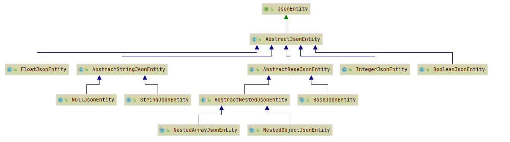
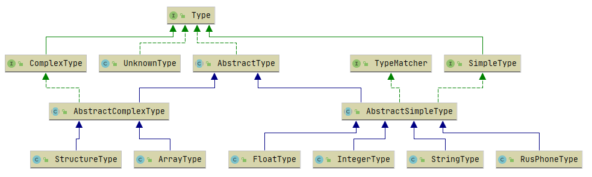

## Техническое задание

Предположим, что перед нами стоит задача обработать HTTP запрос или ответ от стороннего API, содержащий данные в формате JSON. 
Нужно написать санитайзер — класс, который 
а) десериализует JSON-объект в экземпляр указанного программистом типа и 
б) в процессе провалидирует и преобразует в требуемый формат переданные данные.


Требования:

- Самостоятельное выполнение задания без оглядки на существующие решения

- ЯП Java/Kotlin/C# без сторонних библиотек кроме парсера JSON и библиотек для тестирования по своему усмотрению. 
Допускаются SAX-style парсеры или же преобразование в древовидную структуру, описывающую JSON. 
Маппинг данных на классы нужно написать самому.

- Поддержка следующих типов данных:
    - Строка
    - Целое число
    - Число с плавающей точкой
    - Российский федеральный номер телефона
    - Массив с элементами одного фиксированного поддерживаемого типа
    - Структура (ассоциативный массив с заранее известными ключами). 
  Каждая структура десериализуется в экземпляр класса.

- Выбор правил санитизации осуществляется только на основе типа значения, которое мы хотим получить

- Возможность расширения путём добавления поддержки новых типов

- Генерация списка всех ошибок для некорректных значений. 
Формат описания ошибок должен предоставлять возможность сопоставить каждую ошибку с исходным значением. 
Например, если входные данные были сгенерированы на основе HTML-формы с вложенными (табличными) полями, должно быть 
технически возможно сопоставить каждую ошибку конкретному полю формы.

- Тесты


Примеры:

1. из объекта '{"foo": "123", "bar": "asd", "baz": "8 (950) 288-56-23"}' 
при указанных программистом типах "целое число", "строка" и "номер телефона" соответственно 
должен получиться экземпляр какого-то класса с тремя полями: 
целочисленным foo = 123, строковым bar = "asd" и baz = экземпляр класса, описывающего телефон в нормализованном формате "79502885623".

2. при указании для строки "123абв" типа "целое число" должна быть сгенерирована ошибка

3. при указании для строки "260557" типа "номер телефона" должна быть сгенерирована ошибка

## Краткое описание реализации
### JsonEntitySanitizer
JsonEntitySanitizer выполняет санитизацию переданного json-а и инициализацию указанного класса
(должен быть аннотирован @Entity)

#### JsonEntityParser
JsonEntityParser разбирает переданный json из строкого представление на представление 
в виде объектов JsonEntity.

##### JsonEntity
JsonEntity имеет следующую иерархию классов:


Реализуют следующее представление объектов:
```
BaseJsonEntity = NestedObjectJsonEntity | NestedArrayJsonEntity
    NestedObjectJsonEntity = {JsonRow1, ... , JsonRowN} | {}
    NestedArrayJsonEntity = [JsonFieldValue1, ..., JsonFieldValueN] | []
, где JsonRow = JsonFieldName: JsonFieldValue
    JsonFieldName = String
    JsonFieldValue = String | Integer | Float | TRUE | FALSE | NULL | JsonEntity
```

#### Type 
Указывает на типы, поддерживаемые для инициалиализации полей класса.
Реализуется на уровне аннотаций, по следующему принципу.
Основная аннотация @CommonField, которая отмечает класс реализующий интерфейс Type.
@SimpleField и @ComplexField - аннотации на аннотации, которые возвращают значение типа CommonField. 
Их необходимо указывать в аннотациях реализующих конкретные поддерживаемые типы:
- @StringField -> @SimpleField -> @CommonField -> StringType.class
- @IntegerField -> @SimpleField -> @CommonField -> IntegerType.class
- @FloatField -> @SimpleField -> @CommonField -> FloatType.class
- @RusPhoneField -> @SimpleField -> @CommonField -> RusPhoneType.class
- @ArrayField -> @ComplexField -> @CommonField -> ArrayType.class
- @StructureField -> @ComplexField -> @CommonField -> StructureType.class



[Основные тесты](./src/test/java/alexander/ivanov/jsonsanitizer/)

[Примеры моделей, используемые в тестах](./src/test/java/alexander/ivanov/jsonsanitizer/model/)
